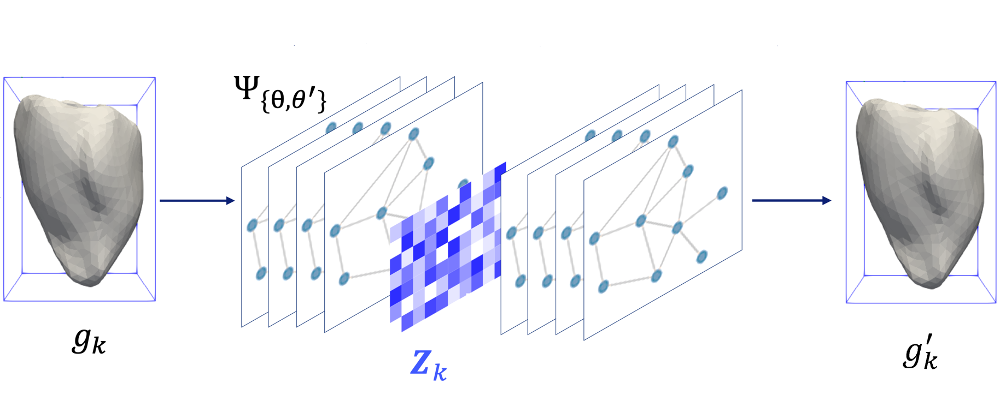

# Variational Graph Autoencoder 

This repository contains a **Variational Graph Autoencoder (VGAE)** model that utilizes **spatial-based graph convolution layers** for feature extraction on vertex-level. The network Ψ is designed to learn nodal embeddings, parameterized by the trainable encoder/decoder weights **{θ, θ′}**.

## Features
- Graph-based feature extraction using **spatial convolution layers**.
- Variational Autoencoder framework for **unsupervised node embedding learning**.
- Implementation in **Python** with **PyTorch and PyTorchGeometric libraries**.

## Model Overview
The feature extraction network Ψ is built using a **Variational Graph Autoencoder**, where:
- **Encoder:** Learns a probabilistic distribution for node embeddings.
- **Decoder:** Reconstructs graph structures from learned embeddings.

### **Model Architecture**
  
*Figure: Variational Graph Autoencoder for Nodal Embedding Extraction*